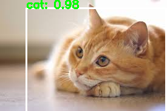

# PyTorch SSD 
[Single Shot MultiBox Detector](https://arxiv.org/abs/1512.02325) implement in PyTorch and OpenCV.

## Dependency
```
python >= 3.5.0
```

pip3 package

```
    torch >= 0.4.0 # or more
    opencv >= 3.3 # or more
```
## Download Pretrain Model

```
mkdir model
cd model
wget https://download.pytorch.org/models/vgg16-397923af.pth
```

## Convert Pretrain Model for SSD

```
python3 script/convert_vgg.py
```

## Download VOC12 training data
From here [VOC12](http://host.robots.ox.ac.uk/pascal/VOC/voc2012/) download train data and unzip to data folder like:

```
pytorch-ssd/data/VOC2012_trainval_train_images/
```
## Train
recommand use pretrain model, if not, the loss desent slowly

```
src/train.py [--lr] [--epoch] [--resume]
```
## Test
```
src/test.py [img_path]
```

# Result
  

This only trained by voc dataset with 7 epoch 

## Credit
This implementation is initially inspired by:
- [Hakuyume/chainer-ssd](https://github.com/Hakuyume/chainer-ssd)  
- [amdegroot/ssd.pytorch](https://github.com/amdegroot/ssd.pytorch)
- [kuangliu/pytorch-ssd](https://github.com/kuangliu/pytorch-ssd.git)
